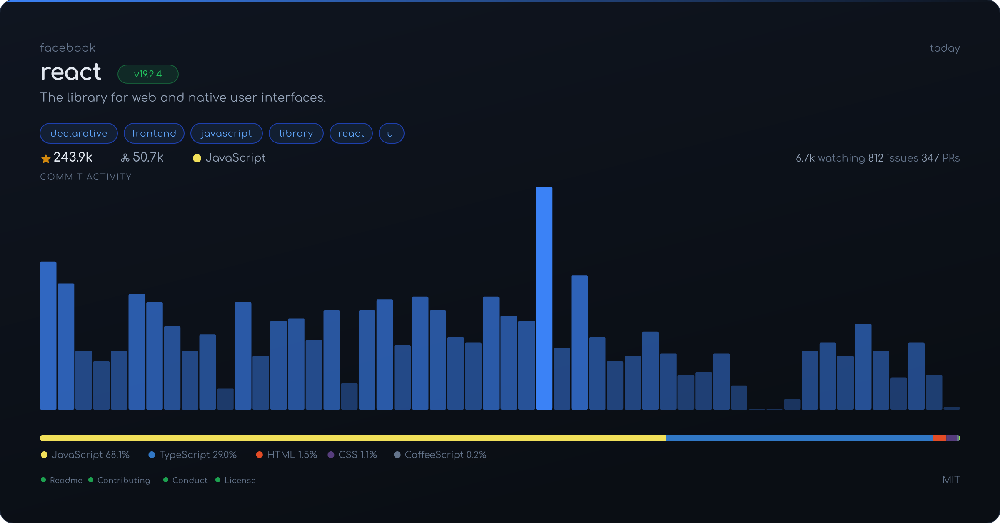
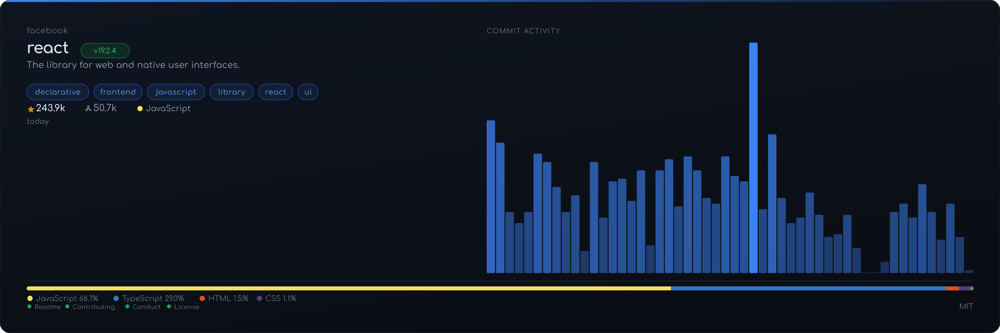

<div align="center">

# ghcard

Generate beautiful social media cards for GitHub repositories.


</div>

### Minimal


### Detailed



### Banner



## Installation

```bash
npx ghcard generate <owner/repo>
```

> [!TIP]
> Requires Node.js 22.18.0+ (uses native TypeScript execution). No build step needed.

For authenticated requests (5,000 req/hour instead of 60):

```bash
export GITHUB_TOKEN=ghp_your_token_here
npx ghcard generate <owner/repo>
```

## Usage

```bash
# Generate a minimal card
ghcard generate facebook/react

# Generate a detailed card
ghcard generate facebook/react --style detailed

# Banner format (1500x500, for Twitter/X headers)
ghcard generate facebook/react --size banner

# Square format (1080x1080, for Instagram)
ghcard generate facebook/react --size square

# Also save the SVG source
ghcard generate facebook/react --svg

# Generate all styles at once
ghcard generate facebook/react --all --out-dir ./cards

# Batch generate from a JSON file
ghcard batch repos.json --style detailed --out-dir ./cards
```

### Options

```
--style <style>      Card style: minimal, detailed                (default: minimal)
--size <size>        Output size: landscape, square, banner       (default: landscape)
--out <path>         Output file path                             (overrides --out-dir)
--out-dir <dir>      Output directory                             (default: ./output)
--svg                Also save the SVG source
--token <token>      GitHub API token for higher rate limits
--all                Generate all styles at once
--help               Show help
```

### Environment

```
GITHUB_TOKEN         GitHub token (alternative to --token)
```

### Batch Mode

Create a JSON file with a list of repos:

```json
[
  { "repo": "facebook/react" },
  { "repo": "vercel/next.js", "style": "detailed" },
  { "repo": "denoland/deno" }
]
```

```bash
ghcard batch repos.json --out-dir ./cards
```

## Card Styles

| Style | Description |
| ----- | ----------- |
| **minimal** | Centered hero layout with repo name, description, and star count |
| **detailed** | Full dashboard with topics, commit sparkline, language breakdown, community health, and more |

## Sizes

| Size | Dimensions | Use case |
| ---- | ---------- | -------- |
| `landscape` | 1200x628 | Twitter/X cards, Open Graph, LinkedIn |
| `square` | 1080x1080 | Instagram, general social |
| `banner` | 1500x500 | Twitter/X header, GitHub social preview |

## Development

```bash
# Install dependencies
npm install

# Run directly (no build needed)
npm run dev -- generate owner/repo

# Build for distribution
npm run build
```

## License

[MIT](LICENSE)

---

> [!NOTE]
> This project was built with assistance from LLMs. Human review and guidance provided throughout.
